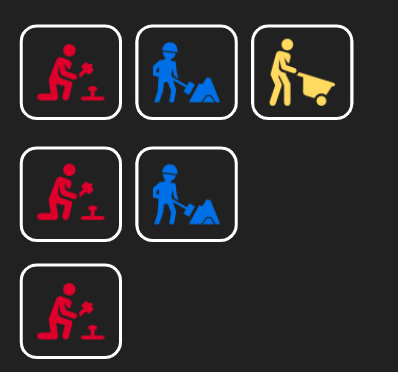
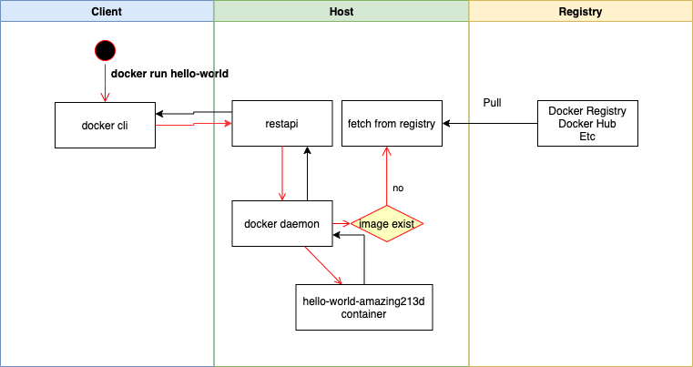
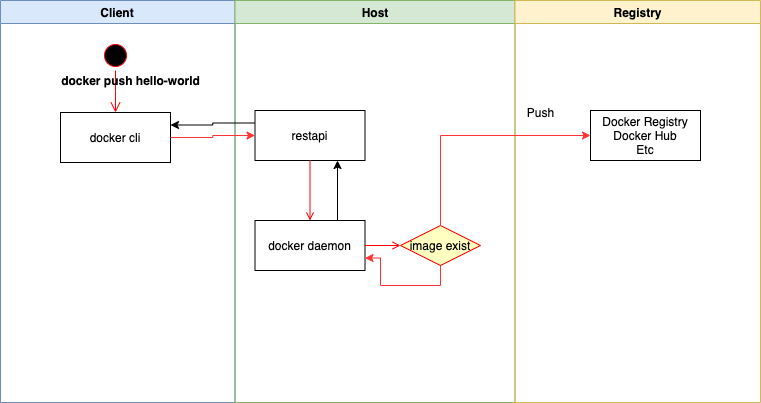

### **Why we need Docker?** 

**Problem 1**

As you can see in the below image that is the most common problem were industries are facing right now.


**Why does it happen?**

It happens because of different computing environments between test & production


## Docker concepts

Docker is a platform for developers and sysadmins*(A **system administrator**, or **sysadmin**, is a person who is responsible for the upkeep, configuration, and reliable operation of computer systems)* to **build, run, and share** applications with containers. The use of containers to deploy applications is called **containerization**. Containers are not new, but their use for easily deploying applications is.

Containerization is increasingly popular because containers are:

- **Flexible**: Even the most complex applications can be containerized.
- **Lightweight**: Containers leverage and share the host kernel, making them much more efficient in terms of system resources than virtual machines.
- **Portable**: You can build locally, deploy to the cloud, and run anywhere.
- **Loosely coupled**: Containers are highly self sufficient and encapsulated, allowing you to replace or upgrade one without disrupting others.
- **Scalable**: You can increase and automatically distribute container replicas across a datacenter.
- **Secure**: Containers apply aggressive constraints and isolations to processes without any configuration required on the part of the user.


**Advantages**

The main advantages of Docker are:

- **Resource Efficiency**: Process level isolation and usage of the container host’s kernel is more efficient when compared to virtualizing an entire hardware server.
- **Portability**: All the dependencies for an application are bundled in the container. This means they can be easily moved between development, test, and production environments.
- **Continuous Deployment and Testing**: The ability to have consistent environments and flexibility with patching has made Docker a great choice for teams that want to move from waterfall to the modern DevOps approach to software delivery.


### Containers and virtual machines

A container runs *natively* on Linux and shares the kernel of the host machine with other containers. It runs a discrete process, taking no more memory than any other executable, making it lightweight.

By contrast, a **virtual machine** (VM) runs a full-blown “guest” operating system with *virtual* access to host resources through a hypervisor. In general, VMs incur a lot of overhead beyond what is being consumed by your application logic.

|  |  |
| ------------------------------------------------------------ | ------------------------------------------------------------ |
|                                                              |                                                              |


## Scaling


**Horizontal scaling means that you scale by adding more machines** into your pool of resources whereas **Vertical scaling means that you scale by adding more power (CPU, RAM) to an existing machine**.


## Example

Imagine that we have 3 different service in our application each man represent services.

- Red man is data analyzing service. It is just 1 MB Python script. It is procession huge data but output is just some statistic.
- Yellow man is data shipper. It just ship data from red man to blue man. It is a Java app.
- Blue man is WebUI. The processed data is show in the WebUI. It is a bootspring app. 


*t=0*

------


-----


*t=10*

-----


-----

*t=20*

-----


----

When customer see the bill, he said that something is wrong.


When you use, containerized app.




# Docker Architecture

The Docker architecture uses a client-server model and comprises of the Docker Client, Docker Host, Network and Storage components, and the[ Docker Registry](https://wiki.aquasec.com/display/containers/Docker+Registries+101)/Hub. Let’s look at each of these in some detail.


## Docker Client

The Docker client enables users to interact with Docker. The Docker client can reside on the same host as the daemon or connect to a daemon on a remote host. A docker client can communicate with more than one daemon. The Docker client provides a command line interface (CLI) that allows you to issue build, run, and stop application commands to a Docker daemon.

**The main purpose of the Docker Client** is to provide a means to direct the pull of images from a registry and to have it run on a Docker host. Common commands issued by a client are:

```
docker build
docker pull
docker run
```

## DockerHost

The Docker host provides a complete environment to execute and run applications. It comprises of the Docker daemon, Images, Containers, Networks, and Storage. As previously mentioned, the daemon is responsible for all container-related actions and receives commands via the CLI or the REST API. It can also communicate with other daemons to manage its services. The Docker daemon pulls and builds container images as requested by the client. Once it pulls a requested image, it builds a working model for the container by utilizing a set of instructions known as a build file. The build file can also include instructions for the daemon to pre-load other components prior to running the container, or instructions to be sent to the local command line once the container is built.


### Images and containers

Fundamentally, a container is nothing but a running process, with some added encapsulation features applied to it in order to keep it isolated from the host and from other containers. One of the most important aspects of container isolation is that each container interacts with its own private filesystem; this filesystem is provided by a Docker **image**. An image includes everything needed to run an application - the code or binary, runtimes, dependencies, and any other filesystem objects required.


### How the Client Talks to the Docker Host

Now let’s visualize how some of the pieces come together:


## How does it works ?

```sh
docker run hello-world
```





```sh
docker push hello-world registry
```




src.

https://dzone.com/articles/all-about-hibernate-manytomany-association

https://wiki.aquasec.com/display/containers/Docker+Registries+101

http://bit.ly/erkanerol-12factor

https://acadgild.com/blog/docker-for-beginner-what-is-architecture-install-commands

https://docs.docker.com/get-started/

https://gokhansengun.com/docker-nedir-nasil-calisir-nerede-kullanilir/